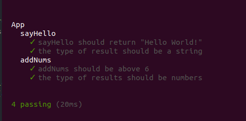
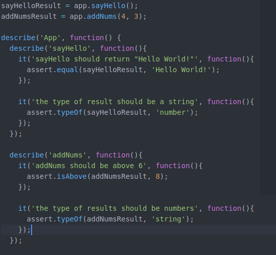
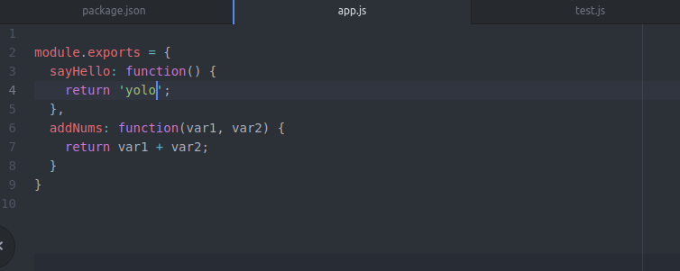
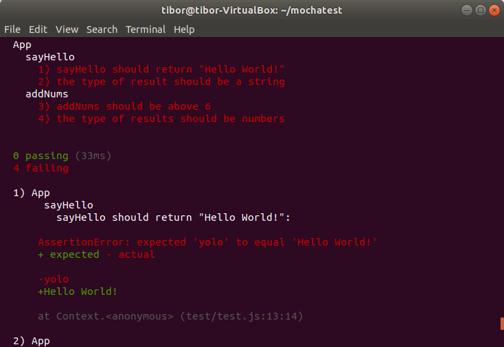
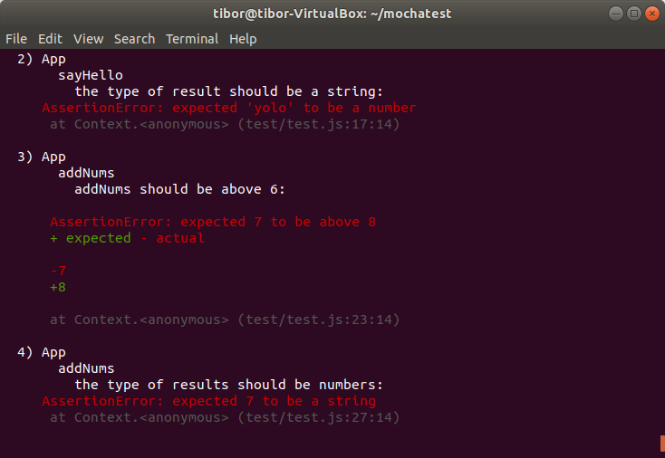

Simple_Mocha_tests
===

---

Technologies
---
- NodeJS: to create simple application
- Mocha: to use the test framework to do JavaScript based tests
- Chai: to use this assertion library to ensure tests are done appropriately

Screenshots:
---
- Passed tests  
  

- Failed tests (on purpose to test the assertions)
   
   For testing assertion, I deliberately made mistakes.
   - On this one, I am trying to return a different string 
   
   But in test.js, I am still trying to look for "Hello World!" and it results in an error. 
   Also, I changed the type of the variable to number and that's why it shows another error.
   
   - The first part of the other test is looking for a sum of numbers which equals to 8 or more, but it only equals 7. 
   Therefore, it fails the predefined criteria. Also, the type is set to string - another fail.
   
  
   
